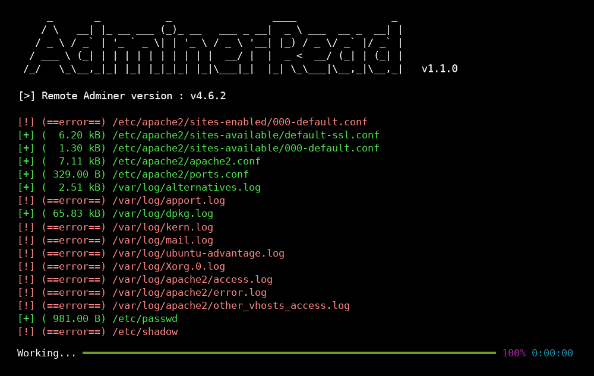
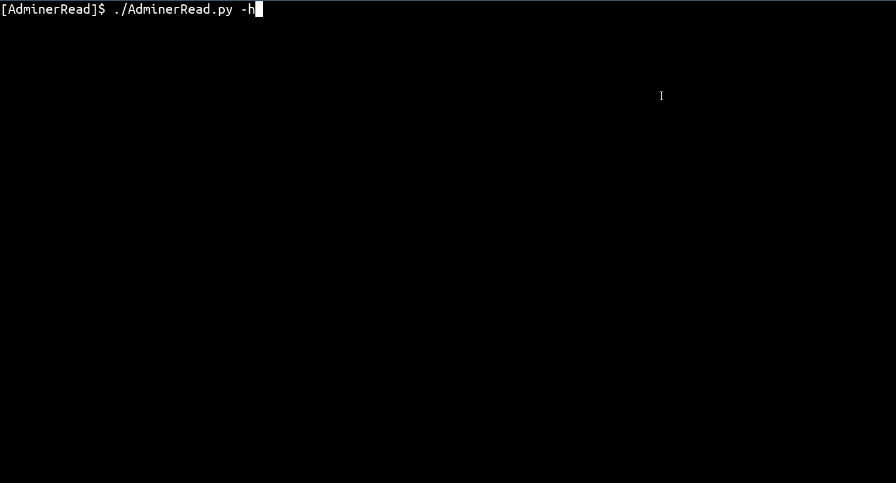
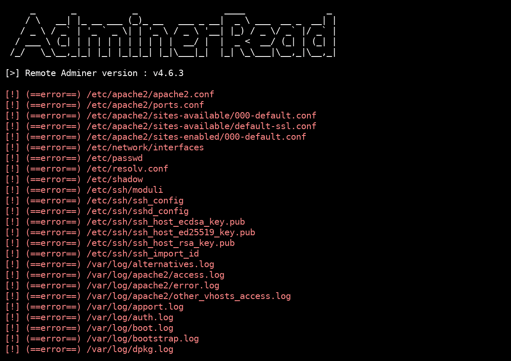

# CVE-2021-43008 - AdminerRead

<p align="center">
    Exploit tool for Adminer 1.0 up to 4.6.2 Arbitrary File Read vulnerability 
    <br>
    
    <a href="https://twitter.com/intent/follow?screen_name=podalirius_" title="Follow"></a>
    <a href="https://www.youtube.com/c/Podalirius_?sub_confirmation=1" title="Subscribe"></a>
    <br>
</p>



## Installation

```
git clone https://github.com/p0dalirius/AdminerRead
cd AdminerRead
sudo python3 setup.py install
```

## Usage



## Vulnerable versions

Adminer version 1.0 up to version 4.6.2 (included) File Read Vulnerability



 ➡️ More detailed information about impacted versions in 

## Contributing

Pull requests are welcome. Feel free to open an issue if you want to add other features.

## References
 - http://sansec.io/research/adminer-4.6.2-file-disclosure-vulnerability
 - https://podalirius.net/en/articles/writing-an-exploit-for-adminer-4.6.2-arbitrary-file-read-vulnerability/
